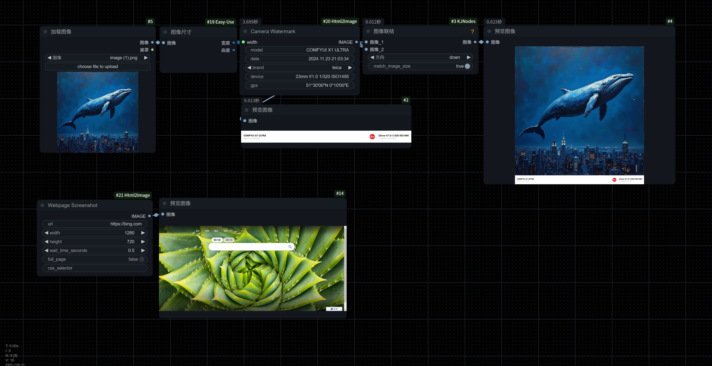

# ComfyUI Html2Image Nodes

提供网页截图和相机水印功能。



## 功能

### 1. 网页截图 (Webpage Screenshot)
可以对任意网页进行截图，支持以下功能：
- 自定义截图尺寸
- 等待时间控制
- 完整页面截图
- CSS 选择器指定区域截图

参数说明：
- `url`: 要截图的网页地址，默认为 "https://example.com"
- `width`: 截图宽度，默认 1280，范围 64-4096
- `height`: 截图高度，默认 720，范围 64-4096
- `wait_time_seconds`: 等待页面加载的时间（秒），默认 0.5，最小 0.1
- `full_page`: 是否截取完整页面，默认 `false`。选中时会忽略 `height` 参数
- `css_selector`: CSS 选择器（可选），用于截取特定元素。例如：".content" 或 "#header"

### 2. 相机水印 (Camera Watermark)
生成类似手机相机的信息水印，支持以下功能：
- 自定义相机型号
- 自动生成时间戳
- 多品牌 Logo 支持
- 自定义拍摄参数
- 自定义 GPS 信息
- 可调整宽度

> 如需更改模板可更改根目录下的 `camera_watermark_template.html` 文件

参数说明：
- `model`: 相机型号，默认为 "COMFYUI X1 ULTRA"
- `date`: 拍摄日期时间，默认为当前时间，格式：YYYY.MM.DD HH:MM:SS
- `brand`: 品牌选择，基于 brand 目录下的 SVG 文件自动生成选项
- `device`: 拍摄参数，默认为 "23mm f/1.0 1/320 ISO1495"
- `gps`: GPS 信息，默认为 "51°30'00\"N 0°10'00\"E"
- `width`: 水印宽度，默认 1280，范围 64-2048

## 安装

1. 将本项目克隆到 ComfyUI 的 `custom_nodes` 目录：
```bash
cd custom_nodes
git clone https://github.com/liuqianhonga/ComfyUI-Html2Image.git
```

2. 安装依赖：
```bash
pip install -r requirements.txt
```

3. 重启 ComfyUI

## 使用示例

### 网页截图节点
1. 普通网页截图：
   - 设置 url 和所需的宽高
   - 调整 wait_time_seconds 确保页面加载完成

2. 完整页面截图：
   - 启用 full_page 选项
   - 设置所需的宽度（height 将被忽略）

3. 特定元素截图：
   - 在 css_selector 中输入目标元素的选择器
   - 例如：".article-content" 或 "#main-header"

### 相机水印节点
1. 基本使用：
   - 设置所需的宽度
   - 其他参数保持默认值

2. 自定义水印：
   - 修改 model 为所需的相机型号
   - 设置自定义的拍摄参数和 GPS 信息
   - 选择不同的品牌 Logo


## 常见问题

### 网页截图相关
1. 截图显示不完整
   - 增加 wait_time_seconds 的值
   - 检查网页是否需要登录或有其他加载条件
   - 确认网页是否有动态加载内容

2. CSS 选择器无法找到元素
   - 确认选择器语法正确
   - 检查元素是否是动态加载的
   - 可能需要增加等待时间

3. 完整页面截图出现问题
   - 检查页面是否有固定定位元素
   - 确认页面高度是否正确计算

### 相机水印相关
1. 品牌 Logo 不显示
   - 检查 brand 目录中是否有对应的 SVG 文件
   - 确保 SVG 文件格式正确
   - 检查文件权限

2. 时间戳格式问题
   - 可以自定义时间格式
   - 支持手动输入时间

3. 水印尺寸问题
   - 宽度会自动计算对应的高度
   - 保持了品牌 Logo 的原始比例
